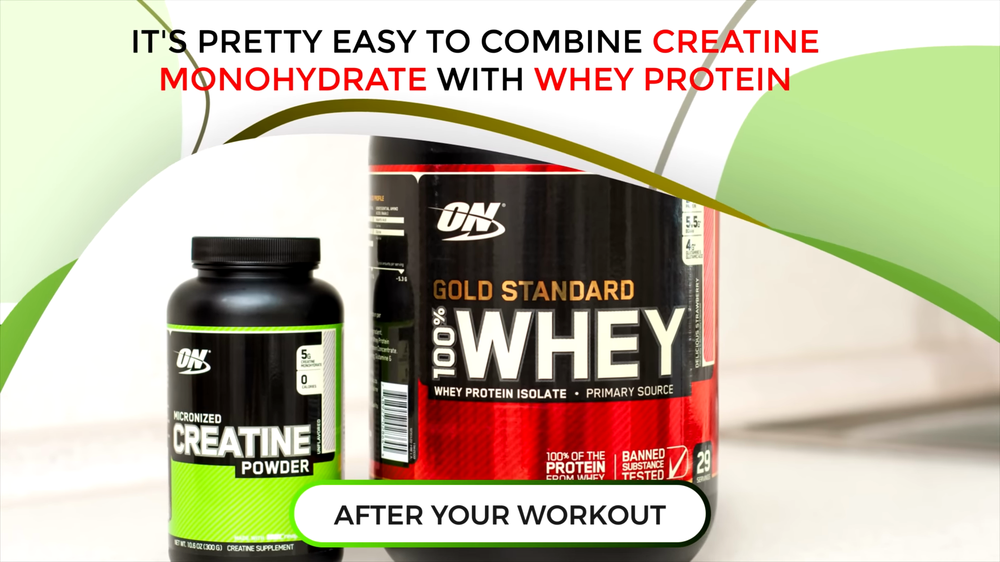
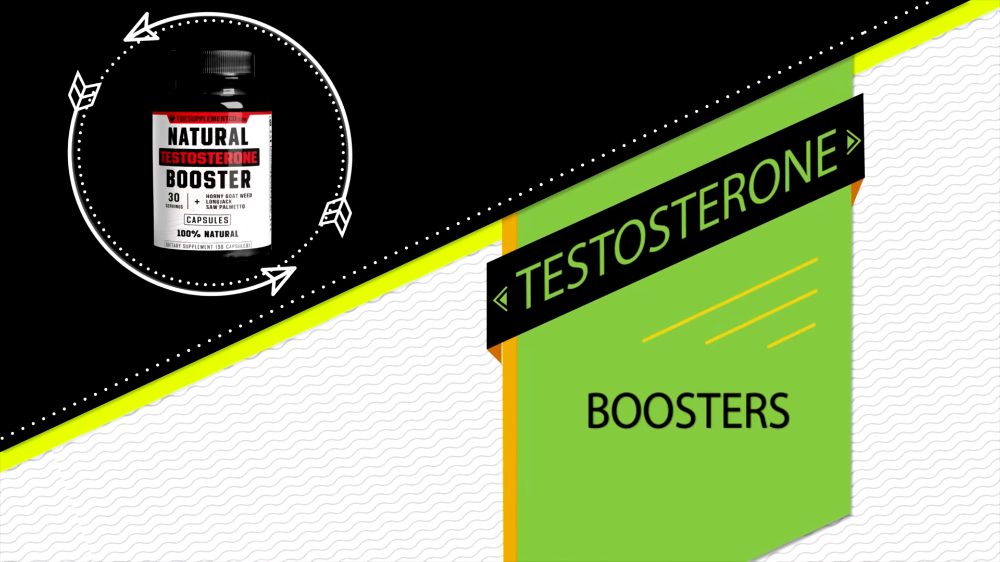

 You can just sit around on the couch, take certain supplements and you'll build massive amounts of muscle.  Obviously I'm kidding, but that's what most supplement companies want you to believe.  Unfortunately, even with all the modern advancements in nutrition science,  your progress is still mostly tied to your overall diet and workout plan.  However, supplements can give you quite an edge, and that edge can truly help you build muscle faster, increase strength, and break through stagnation, and stubborn plateaus.  So today I want to go over 8 supplements that can help force muscle growth even when you're feeling totally stuck.

 And first I want to start with carnocein, which is actually a combination of beta-alienine and histidine.  Both beta-alienine and histidine are abundantly present in many tissues throughout the body, including the brain, gut, heart, and the muscles.

 One of the key roles of carnocein in muscle physiology is its ability to combat muscle fatigue by reducing the build-up of acidic substances within your muscles.

 These acidic substances accumulate as you work out, and a lot of that burn as well as fatigue that sets in as you're lifting weights for reps is caused by these acidic substances.

 By lowering this acidity, both beta-alienine and el histidine can improve endurance, helping you squeeze out one or two additional reps before failure,  which can make a huge difference in your muscle building progress since building muscle is predominantly tied to progressive overload or simply put increasing reps and weight load over time.

 On top of that, carnocein is actually an antioxidant, helping to protect muscle cells from oxidative stress and damage.  It also plays a role in regulating calcium levels within muscle cells, which is very important for muscle contractions.

 Carnocein is actually a common addition already found in many pre-workout supplements, and pre-workouts are actually the next supplement that can make a big difference when it comes to building muscle.

 One of the ways that pre-workouts provide this benefit is by increasing your energy and your focus.

 This is because most of them contain stimulants like caffeine, for example.  Having more focus and energy can help you perform more intense workouts, lift heavier weights, and ultimately gain strength and muscle.  Another benefit of pre-workouts is that they commonly contain nitric oxide boosters like el citralline and elarginine.

 These amino acids promote vascular dilation, or in other words, expansion of your blood vessels, which helps increase blood flow to your muscles.

 This leads to what's commonly referred to as the pump, which can improve nutrient delivery and the removal of waste products, potentially supporting muscle growth.  One thing to keep in mind is that the more that you take pre-workouts, the more reliant you'll be on them, and you'll probably feel less and less of an energy boost.  Like any other stimulant, your body will develop a tolerance, so I recommend not using pre-workouts every day, and instead only use it on the days that you're lifting heavy and really trying to push yourself to grow.

 Now, let's move on to one of the most widely studied and proven supplements for building muscle, creatine.  We know that creatine enhances exercise performance by increasing your body's stores of phosphocreatine, which is a quick acting energy source used during short bursts of high intensity activity, such as weight lifting.

 This allows you to lift heavier weights and perform more reps, which over time should lead to greater muscle stimulation and growth.  Creatine also increases the retention of water within muscle cells, leading to increase cell volume and improve hydration.

 Not only does this make your muscles appear full and larger, but the cellular swelling can trigger certain and symbolic pathways that lead to muscle growth.  At the same time, creatine helps stimulate muscle protein synthesis while reducing myostatin levels, which is a protein that interferes with muscle growth.

 Your body is constantly breaking down muscle tissue when you work out, and in general throughout the day, as you move around.  Since building muscle is highly dependent on increasing protein synthesis while reducing muscle protein breakdown, creatine can be very helpful.

 As if that's not enough reason to try creatine, it also is associated with faster muscle recovery by reducing inflammation, allowing for more frequent intense training sessions.

 To get started, you can simply take 5 grams of creatine per day after your workouts. It'll take about 3 to 4 weeks of consistent use to fully saturate your muscles with creatine to experience all the benefits.

 Another very effective proven supplement is way protein, and it's pretty easy to combine creatine monohydrate with way protein after workout.

 Even though you can get enough protein from your diet alone, most people don't, and a way protein shake helps them meet their daily requirements necessary for optimal muscle growth.  Way specifically is one of the best protein sources, not only because it contains all the essential amino acids, but also because it's very bio-available, allowing it to be rapidly digested and absorbed by the body.

 This makes it an excellent choice for stimulating muscle protein synthesis.  Way protein has also been shown to enhance the antibiotic response to resistance training when consumed post workout, especially when combined with carbohydrates, probably due to the insulinogenic effects of carbohydrates in combination with way protein, which helps deliver the protein into your cells more efficiently.

 Another benefit of way is that it's high in losing, which is one of the most important amino acids from muscle growth and recovery.  Now, if you struggle to add calories to your diet, you can take the next supplement on our list, which is a homemade wake-in or shake.  These will typically include a powdered protein source like way protein, in combination with foods like oats, bananas, whole milk, and peanut butter.

 Not only will blending these ingredients create an absolutely delicious post workout shake, but they'll also obviously add a bunch of calories along with nutrients that are great for recovery.  If you struggle to gain weight or bulk up, these additional calories can be exactly what you're missing.

 You see, once you're past the beginner stage of muscle growth, you'll need to be in a calorie surplus to continue building muscle.  And sometimes it's plain difficult to get enough calories from whole foods because they tend to be very filling for the amount of calories that they provide.  By making one of these wake-in or shakes, you can easily get around this problem and provide your body the raw materials it needs to build more muscle.

 Next is vitamin D, and this is especially effective and recommended for those of you that live in cold environments where you don't get much sunshine.  This is because your body can naturally synthesize vitamin D by spending time outdoors and absorbing UV rays.  But if you can't get enough of that, supplementing with vitamin D can provide many benefits.

 For example, vitamin D receptors are present in muscle tissue, which is why studies have shown that people with higher vitamin D levels tend to have better muscle strength and performance.  Some research also suggests that adequate vitamin D levels can promote a greater proportion of type 2 muscle fibers versus type 1 muscle fibers.

 This influence on muscle fiber composition is beneficial because type 2 fibers are the ones that are more associated with greater muscle force, power and size.

 Vitamin D is also another nutrient that helps support protein synthesis, which once again contributes to muscle development.  Another often overlooked supplement is omega-3.  Now, even though omega-3 isn't going to lead to muscle growth in the same more direct ways that creatine, pre-workouts and way protein will,

 it still carries plenty of indirect benefits, especially if you're one of the many people not getting enough of it from your diet.

 Omega-3 fatty acids have been proven to enhance muscle protein synthesis while also reducing muscle protein breakdown.

 This may be tied to the anti-inflammatory effects that these fatty acids provide.

 They've also been associated with enhanced neuromuscular function, which is essentially your brain and nerves being able to communicate with your muscles more efficiently.

 Improving neuromuscular coordination can lead to more effective workouts and in turn, more muscle growth.  Omega-3s have been linked to improved blood flow as well, which, like I already mentioned, this helps deliver nutrients and oxygen to your muscle tissues, assisting with recovery and performance.

 Taking fish oil or krill oil daily can help you meet your recommended daily omega-3 intake, but you can also get plenty from wild caught fatty fish like salmon, sardines and macrol.  Now, before we move on to some supplements that don't work, I want to mention one that's on the borderline due to the mixed results that it's shown in studies.  I'm referring to HMB, which is one of the lesser known supplements associated with muscle growth.  HMB is believed by some to enhance muscle protein synthesis, which again is a key process in the muscle repair and growth cycle.  Although the evidence isn't as strong as some of the other supplements that I've already mentioned, there are several studies that have shown that HMB can lead to an increase in muscle protein content,

 which is a positive indicator for muscle growth. It also has shown the potential to reduce muscle damage, which, like I said, would allow you to train more frequently with higher levels of intensity.  And HMB is believed to have some anti-catabolic effects, which means that it can help prevent the breakdown of muscle tissue leading to the preservation and growth of muscle mass.  Other studies also show that it may boost strength and performance, which can indirectly lead to muscle growth by helping you lift heavier weights.  With all that said, you should know that there is other research out there that shows that HMB may not be very effective at increasing muscle mass in athletes, or especially adults who already have a good amount of weight training experience.

 Instead, it might be more effective for beginners and can be highly dependent on how you react as an individual.  If you'd like to try to see if it works, you can try taking 3-6 grams per day, split in half before your workout and after your workout.  But, like I said, there are quite a few popular muscle building supplements that are actually proven to be ineffective and a waste of your money.  For example, testosterone boosters. Most of them, they do sound great, but the scientific evidence shows us that most of those over-the-counter testosterone boosters don't enhance muscle.

 One reason is because they don't increase testosterone levels high enough to cause any significant noticeable physiological changes.

 Another problem with over-the-counter test boosters is that your body's hormone regulation system happens to be very highly complex.  Simply supplementing with isolated compounds like testosterone boosters is unlikely to effectively mimic the natural hormonal balance that's necessary.

 This is why maintaining a balanced diet full of healthy whole foods, getting regular exercise and also getting plenty of sleep is usually far more effective at boosting your testosterone.

 Another unnecessary supplement is BCAAs or branch chain amino acids.  As long as you take it enough protein throughout the day in the form of food or protein shakes, your body will already break down that protein into all the essential amino acids you need for muscle growth.

 Elguda mean is another one that falls into this amino acid category and is commonly used even though it's highly unnecessary with a sufficient protein intake.  One last unnecessary supplement that I'm going to mention in this video is DHEA.  To put it simply, it's commonly marketed for anti-aging and muscle building purposes, but it lacks scientific support for these claims and using it can carry potential risks.  These include affecting hormonal balance, impacting your mood and behavior, stressing the liver and kidneys and affecting bone health by interfering with calcium metabolism.  Definitely not worth the risks if you ask me.  So that about wraps it up. I really hope you enjoyed this video. If you have, make sure you subscribe to the channel.  And if you want any extra help with not only supplements but also setting up an entire diet and training plan that will provide the other 95% of your results, then visit my website.  You can get our entire program for free just by staying consistent and sticking to the plan.  It'll come with a full workout program, a diet plan based on your preferences, a 42 recipe cookbook and a coach will be there to guide you through the entire process.  To find out more, you just need to click the link in the description or you can head straight on over to my website at gravitytransformation.com.  I'll see you guys soon.