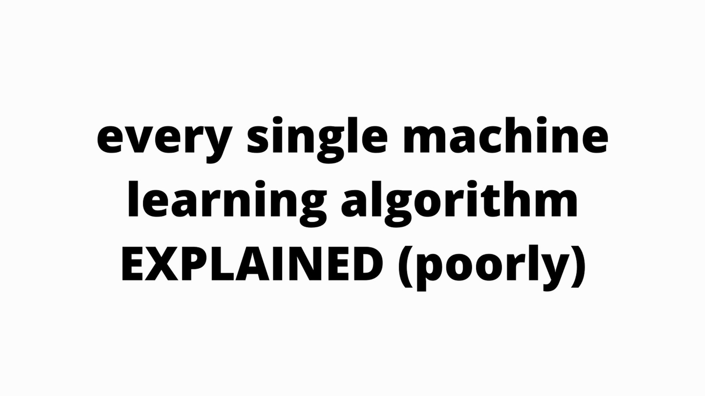
 Every single machine learning algorithm explained. In case you don't know an algorithm is a set of  commands that must be followed for a computer to perform calculations or like other problem-solving

 operations. According to its formal definition, an algorithm is a finite set of instructions  carried out in a specific order to perform a particular task. It's not an entire program or code,

 it is simple logic to a problem. Linear regression is a supervised learning algorithm and tries to  model their relationship between a continuous target variable and one or more independent variables

 by fitting a linear equation to the data. Take this chart of dots, for example. A linear regression  model tries to fit a regression line to the data points that best represents their relations or  correlations. With this method, the best regression line is found by minimizing the sum of squares
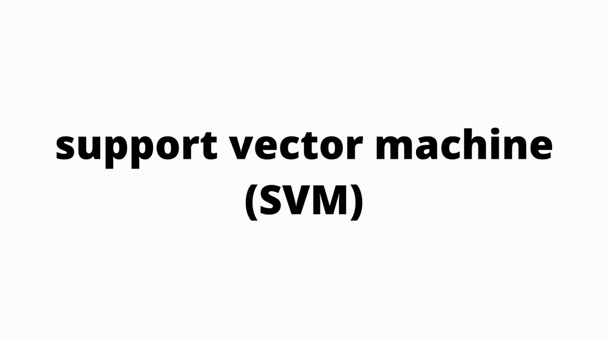
 of the distance between the data points and the regression line. So for these data points,  their regression line looks like this. Support vector machine or SVM for short is a supervised  learning algorithm and is mostly used for classification tasks but is also suitable for regression tasks.

 SVM distinguishes classes by drawing a decision boundary. How to draw or determine the  decision boundary is the most critical part in SVM algorithms. Before creating the decision boundary,  each observation or data point is plotted in n-dimensional space with n being the number of features  used. For example, if we use a length and width to classify different cells, observations are  plotted in a two-dimensional space and decision boundary is aligned. If we use three features,  the decision boundary is a plane in three-dimensional space. If we use more than three features,  the decision boundary becomes a hyperplane which is really hard to visualize. The decision boundary  is drawn in a way that the distance to support vectors are maximized. If the decision boundary is too

 close to a support vector, it will be highly sensitive to noises and not generalize well.  Even very small changes to independent variables may cause a misclassification. SVM is a  specially effective in cases where number of dimensions are more than the number of samples.  When finding the decision boundary, SVM uses a subset of training points rather than all points,  which makes it memory efficient. On the other hand, training time increases for large data sets,  which negatively affects the performance. Naive Bayes is a supervised learning algorithm used  for classification tasks. Hence, it is also called Naive Bayes classifier. Naive Bayes assumes that  features are independent of each other and there is no correlation between features. However,

 this is not the case in real life. This naive assumption of features being uncorrelated is the  reason why this algorithm is called naive. The intuition behind naive Bayes algorithm is the  Bayes theorem. PAB is the probability of events A given events B has already occurred.  PBA is the probability of events B given events A has already occurred. PA is the probability of  events A and PB is the probability of events B. Naive Bayes classifier calculates the probability of  a class given a set of feature values. The assumption that all features are independent makes  Naive Bayes algorithm very fast when compared to complicated algorithms. In some cases, speed is  preferred over higher accuracy. But on the other hand, the same assumption makes Naive Bayes algorithm  less accurate than complicated algorithms. Logistic regression is a supervised learning algorithm
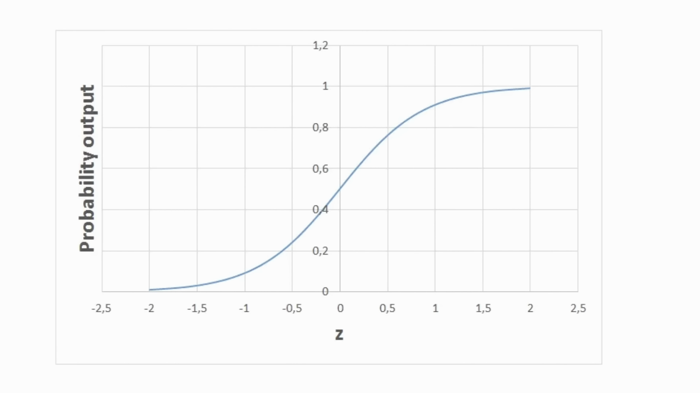
 which is mostly used for binary classification problems. Logistic regression is a simple yet very  effective classification algorithm, so it is commonly used for many binary classification tasks.  Things like customer churns, spam, email, website, or ad click predictions are some examples of  the areas where logistic regression offers a powerful solution. The basis of logistic regression  is the logistic function, also called the sigmoid function, which takes any real value number and  maps it to a value between zero and one. Let's consider we have the following linear equation to solve.  Logistic regression model takes a linear equation as input and uses logistic function and log  to perform a binary classification task. Then we will get the famous shaped graph of logistic regression.  We can use the calculated probability as is. For example, the output can be the probability that  this email is spam is 95%, or the probability that the customer will click on the ad is 70%. However,  in most cases, probabilities are used to classify data points. For example, if the probability is
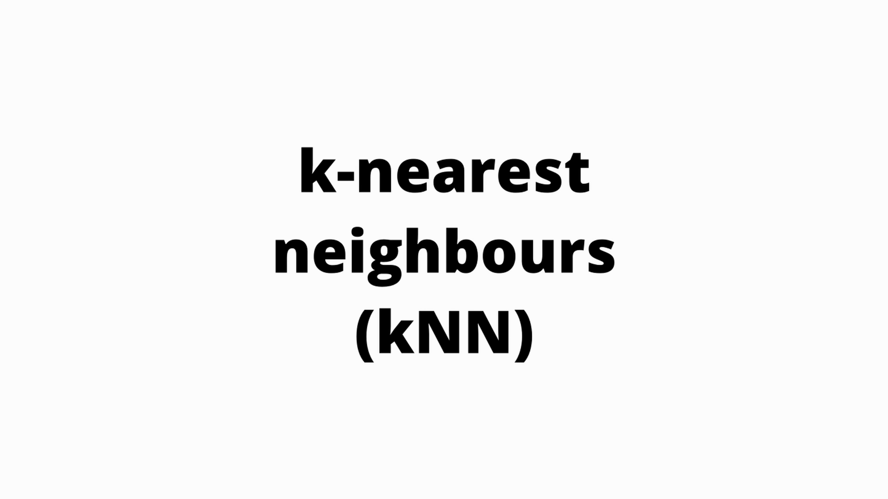
 greater than 50%, the prediction is positive class, or one. Otherwise, the prediction is negative class  or zero. K nearest neighbors, or K and N for short, is a supervised learning algorithm that can be  used to solve both classification and regression tasks. The main idea behind K and N is that the  value of a class or of a data point is determined by the data points around it. K and N class
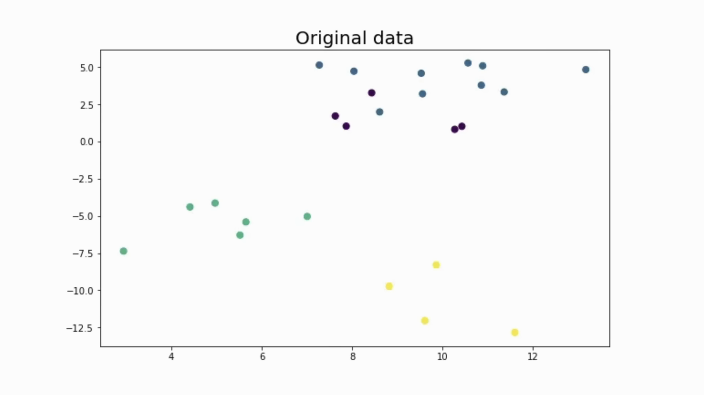
 fire determines the class of a data point by majority voting principle. For instance, if K is set  to five, the classes of five closest points are checked. Prediction is done according to the  majority class. Similarly, K and N regression takes the mean value of five closest points. Let's go

 over an example. Consider the following data points that belong to four different classes.  And let's see how the predicted classes change according to the K value. It is very important to  determine an optimal K value. If K is too low, the model is too specific and not generalized well.  It also tends to be too sensitive to noise. The model accomplishes a high accuracy on  train set, but will be a poor predictor on new previously unseen data points. Therefore,  we are likely to end up with an overfit model. On the other hand, if K is too large,  the model is too generalized and does not have a predictor on both train and test sets.
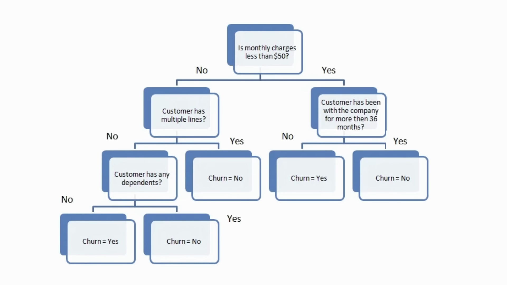
 The situation is known as underfitting. K and N is simple and easy to interpret. It does not  make any assumptions, so it can be implemented in non-linear tasks. K and N does become very slow  as number of data points increases because the model needs to store all data points. Thus,  it is not memory efficient. Another downside of K and N is that it is sensitive to outliers.  Decision trees work by iteratively asking questions to partition data. It is easier to conceptualize  the partitioning data with a visual representation of the decision tree. This represents a decision  tree to predict customer churn. First, split is based on monthly chart's amount. Then the algorithm  keeps asking questions to separate class labels. The question gets more specific as the tree gets  deeper. The aim is to increase the predictivis as much as possible at each partitioning so that  the model keeps gaining information about the data set. Randomly splitting, the feature does not  usually give us the valuable insight into the data set. It lets that increase purity of nodes  that are most informative. The purity of a node is inversely proportional to the distribution  of different classes in that node. The questions to ask are chosen in a way that increases purity  or decreases impurity. But how many questions do we ask when do we stop? When is our tree sufficient
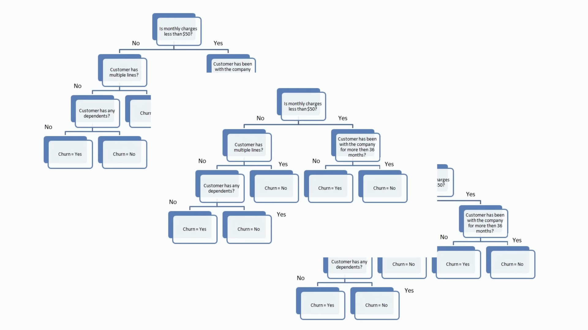
 to solve our classification problem? The answer to all of these questions leads us to one of the most  important concepts in machine learning overfitting. The model can keep asking questions until all nodes  are pure. However, this would be a two specific model and it would not generalize will. It achieves  high accuracy with training set but performs poorly on new previously unseen data points which indicates  overfitting. The decision tree algorithm usually does not require to normalize or scale features.  It is also suitable to work on a mixture of feature data types. On the negative side, it is  prone to overfitting and needs to be unsombled in order to generalize will. Random forest is an  ensemble of many decision trees. Random forests are built using a method called bagging in which  decision trees are used as parallel estimators. If you use for a classification problem, the result is  based on majority vote of the results received from each decision tree. For regression, the prediction  of a leaf node is the mean value of the target values in that leaf. Random forest regression takes  mean values of results from decision trees. Random forests reduce the risk of overfitting and accuracy  is much higher than a single decision tree. Furthermore, decision trees in a random forest run in  parallel so that the time does not become a bottleneck. The success of a random forest highly depends
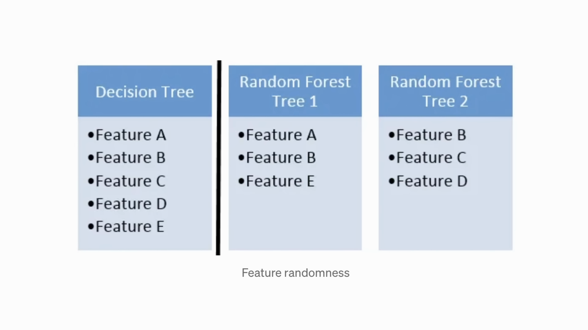
 on using uncorrelated decision trees. If we use the same or very similar trees, the overall result  will not be much different than the result of a single decision tree. Random forests achieve to  have uncorrelated decision trees by bootstrapping and feature randomness. Bootstrapping is randomly  selecting samples from training data with replacement. They are called the bootstrapped samples.  Feature randomness is achieved by selecting features randomly for each decision tree in a random  forest. The number of features used for each tree in a random forest can be controlled with max

 underscore features parameter. Random forest is a highly accurate model on many different problems  and does not require normalization or scaling. However, it is not a good choice for high-dimensional  datasets compared to fast linear models. Gradient boosted decision trees or GBDT for short is an  ensemble algorithm which uses boosting methods to combine individual decision trees. Boosting means
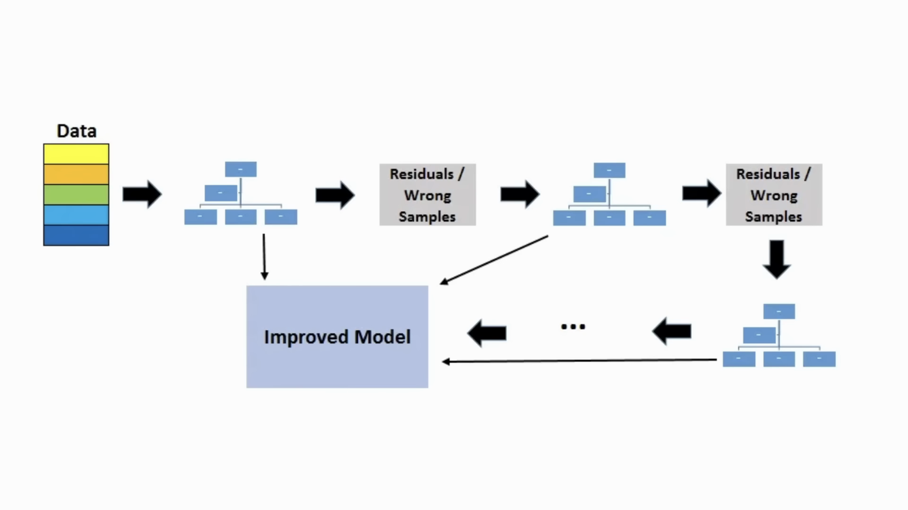
 combining a learning algorithm in series to achieve a strong learner from many sequentially  connected weak learners. In the case of GBDT, the weak learners are the decision trees. Each tree  attempts to minimize the errors of previous tree. Trees in boosting are weak learners but adding  many trees in series and each focusing on the errors from the previous one make boosting a highly  efficient and accurate model. Unlike bagging, boosted does not involve bootstrapped sampling.  Every time a new tree is added, it fits on a modified version of the initial dataset.  Since trees are added sequentially, boosting algorithms learn slowly. In statistical learning,  models that learn slowly perform better. GBDT is very efficient on both classification and regression  tasks and provides more accurate predictions compared to random forests. It can handle mixed  type of features and no preprocessing is needed. GBDT does require careful tuning of hyper parameters  in order to prevent the model from overfitting. K means clustering. Clustering is a way to group
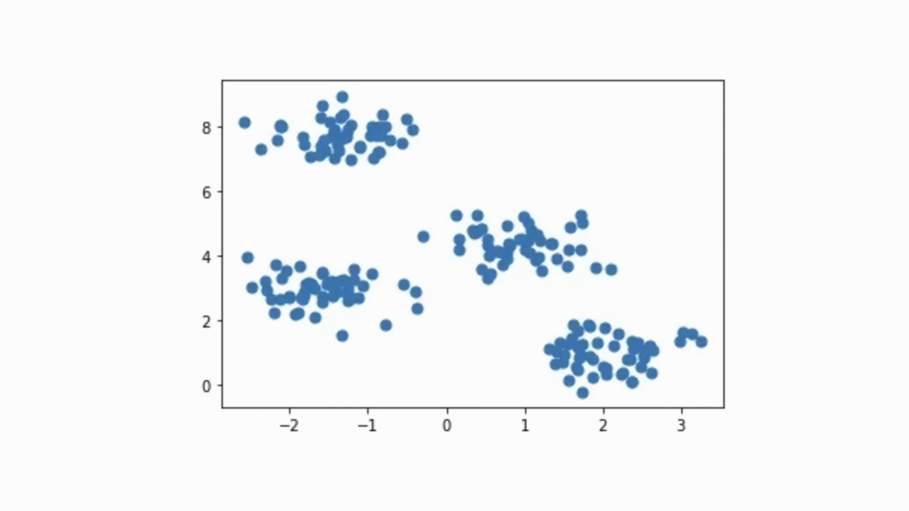
 a set of data points in a way that similar data points are grouped together. Therefore, clustering  algorithms look for similarities or dissimilarities among data points. Clustering is an unsupervised learning  method so there is no label associated with data points. Clustering algorithms try to find the  underlying structure of the data. Observations or data points in a classification task have labelled.  Each observation is classified according to some measurements. Classification algorithms try to  model the relationship between measurements on observations and their assigned class. Then the  model predicts the class of new observations. K means clustering aims to partition data into K  clusters in a way that data points in the same cluster are similar and data points in different  clusters are further apart. Thus, it is a partition-based clustering technique. Similarity of two  points is determined by the distance between them. Consider the following to the visualization of a  dataset. It can be parsioned into four different clusters. Now, real-life datasets are much more  complex in which clusters are not clearly separated. However, the algorithm works in the same way.  K means is an iterative process. It is built on expectation, maximization, algorithm. After the
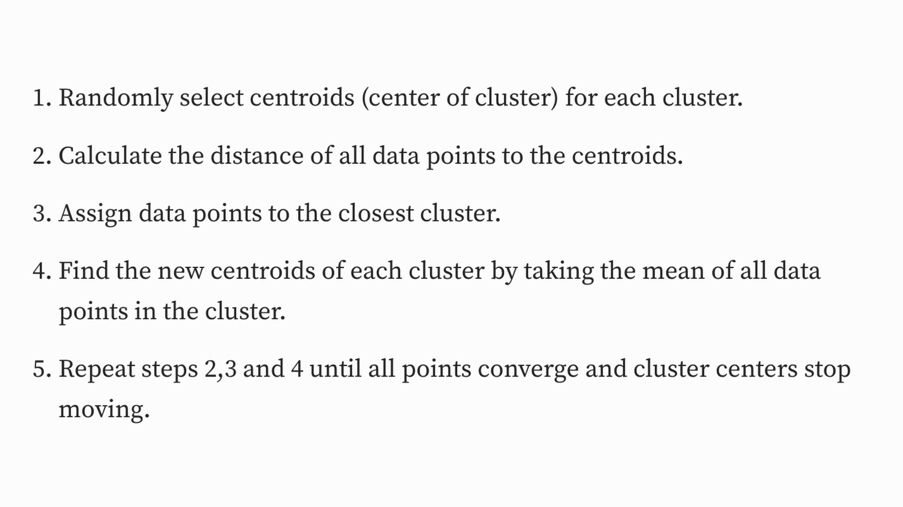
 number of clusters are determined, it works by executing the following steps. Number one, it randomly  selects the centroid or the center of cluster for each cluster. Then it calculates the distance of  all data points to the centroid. It assigns the data points to the closest cluster. It finds the new  centroid of each cluster by taking the mean of all data points in the cluster. It repeats steps  to three and four until all points converge and cluster centers stop moving. K means clustering  is relatively fast and easy to interpret. It is also able to choose the positions of initial  centroid in a smart way that speeds up the convergence. The one challenge with K means is that the

 number of clusters must be predetermined. K means algorithm is not able to guess how many clusters  exist in the data. If there is a non-linear structure separating groups in the data,  K means will not be a good choice. DB Stan clustering Partition based and hierarchical  clustering techniques are highly efficient with normal shaped clusters. However, when it comes to  arbitrary shaped clusters or detecting outliers, density based techniques are more efficient. DB  Stan stands for density based spatial clustering of applications with noise. It is able to find arbitrary  shaped clusters and clusters with noise. The main idea behind DB Stan is that a point belongs to a

 cluster if it is close to many points from that cluster. There are two key parameters of DB Stan.  EPS, which is the distance that specifies the neighborhood. Two points are considered to be  neighbors if the distance between them are less than or equal to EPS and menPTS, which is the minimum

 number of data points to define a cluster. Based on these two parameters, points are classified as  core point, border point, or outlet. A point is a core point if there are at least menPTS,  number of points, including the point itself, in its surrounding area with radius EPS. A point  is a border point if it is unreachable from a core point and there are less than menPTS number  of points within its surrounding area. And a point is an outlier if it is not a core point  and not reachable from any core points. DB Stan does not require to specify a number of clusters
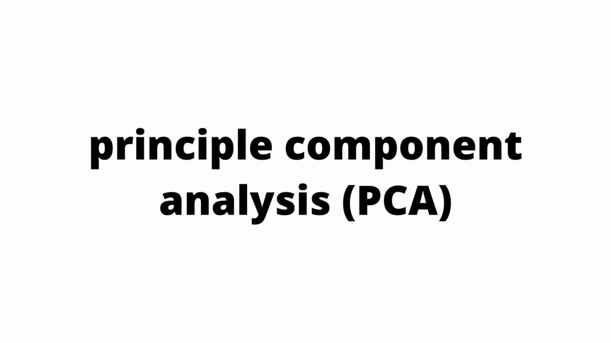
 beforehand. It is robust to outliers and able to detect the outliers. In some cases,  determining an appropriate distance of neighborhood EPS is not easy and it requires domain knowledge.  Principal components analysis or PCA is a dimensionally reduction algorithm which basically  derives new features from the existing ones with keeping as much information as possible. PCA  is an unsupervised learning algorithm, but it is also widely used as a pre-processing step for
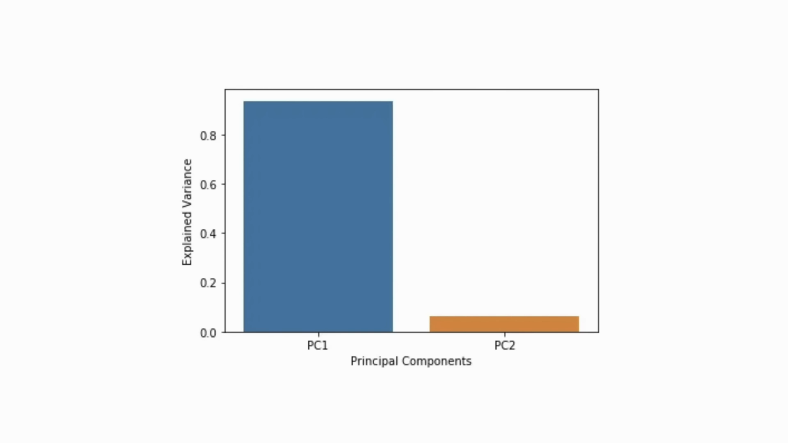
 supervised learning algorithms. PCA derives new features by finding the relations among features  in a dataset. The aim of PCA is to explain the variance within the original dataset as much  as possible by using less features. The new derived features are called principal components.  The order of principal components is determined according to the fraction of variants  of original dataset they explain. The advantage of PCA is that a significant amount of variance
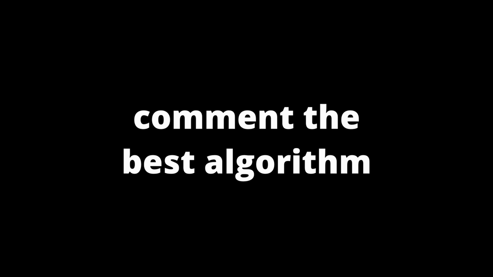
 of the original dataset is retained using much smaller number of features than the original  dataset. Principal components are ordered according to the amount of variants that they explain,  and that is every common machine learning algorithm explained.