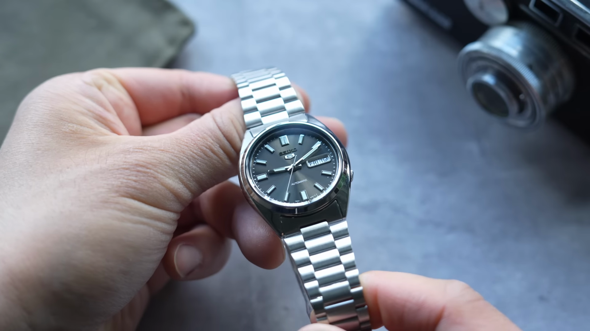
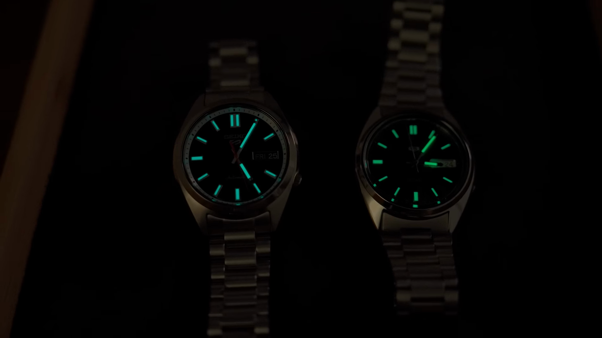

## Introduction to the Seiko SNXS

If you've been even a casual watch fan, you will fall into one of two categories. You either know the Seiko SNXS and have seen all the videos titled the $100 Seiko, that piece Rolex, or you've been living in blissful ignorance of the glory that is this watch.

In which case, I think you'll really enjoy this video. Me, I've owned the SNXX on more than one occasion.

The first one I gave to a buddy who was going on his first big boy interview years ago, this watch is a legend, right? The Seiko has gone and tried to reinvent it. But can you reinvent a legend? Well today we've got the old watch and the new watch together. So let's find out. Hey guys, I'm Max and this is Watch Crunch. Watch Crunch is an app that we developed as a one-stop shop for talking watches because

we got tired of the shenanigans on social media and clunky forums, so come join thousands of your watch friends already on Watch Crunch. They're watches we love because of their movements or their impeccable finishing or even their bracelets. The SNXX is none of the above, but I still love this watch to death simply because of what they could accomplish for a little more than a hundred bucks. If you haven't owned one, I'll tell you the word that comes out of your mouth when you first open this box is, how?

## The Seiko SNXS: Design and Features

How is this a $100 watch? This dial alone is easily a $500 dial. It's got a deep gray color with a strong dollop of sunbursts and when the light hits the just right, brown tones jump out.

Just kind of looks like a pearl. The dark coloration keeps this watch dressy and classy, but the sunburst keeps it fun and sporty. Yes, the design is very similar, visually, to a day just, but that's like waking up looking in the mirror and saying you look too much like Brad Pitt. For one 50th of the price of the day just, this is a compliment the Seiko can take to the

bank. Though not a direct copy, the SNXX has his own twist on that day just theme. We do get rectangular hour markers, which are fatter at the 6 and 9 and doubled up at the 12. A framed day day window is found at the 3 and even the Seiko 5 logo is applied, unheard of at this price. This simplicity and the spacing of all these elements really makes this style shine.

Now, 37mm sounds small, but it's got a cushion shaped case that has an imposing stance. It's mostly polished and unfortunately has a bulbous case back that makes this watch

not really wanting to sit on your wrist flat. But thankfully, it's a relatively thin watch at just 11.5mm, so it's still not too obstructive.

## Longevity and Movement

This watch, as far as I can tell, has been around for a decade or more. If you guys know precisely when it was introduced, put it in the comments. But it was available when I first got into watches over 10 years ago and it follows that

classic Seiko 5 recipe of being automatically winding, a day day display, durable case, crown at the fore and water resistance. Though the last bit is a bit lacking at only 30mm, but that crown does tuck deeply into the case, so there's no worries about knocking it loose while on the wrist. The movement is seen through a display case back is the 7S26, which is a mechanical workhorse that Seiko puts in a lot of their watches, at least back in the day.

Most watches at $100 are quartz, so to get anything mechanical is a blessing, but I suggest you don't stare at this movement too closely because it's quite basic and doesn't even offer frills like hacking and winding. Now we get to the weakest point of this watch, which is the bracelet. Now, if you are a fan of modernity, this isn't it. The bracelet made of folded links is light, kind of slack and rattly. It's finished with the stamped friction class and is adjusted using those stupid metal

forks that makes me modern, unspeakable obscenities when I try to remove a link. But hey, do I have to remind you this is a $100 watch? The saying goes, don't fix what a broke. What Seiko is having none of it, because this year they introduced the new SRPK.

## The New SRPK: A Successor to the SNXS

A successor to the S-NXX in three different colors. I picked up the black one because they made for a more direct comparison, but there's also a blue and a champagne color. The latter has a sunburst finish that probably best resembles the finish of the old watch, but hey, I wasn't about to buy three watches just to make this one video. I don't love you guys that much. As we've seen in recent years, Seiko prices have climbed and at $400, this is a bit of a sticker shock compared to the original.

That's objectively $400 is not astronomical this day and age for a watch. So the question is, did they improve this watch enough to justify it? First impressions are good. I'm glad they kept the smaller size only bumping the case to 37.5mm. There are too many 40mm Seiko's out there. I have a 6.5mm wrist. My ideal size is more like 38.39mm. The finishing on this case though is a big step up. You can tell that the machines that made this watch is a lot more precise than the previous one.

The watches still get hard-lex crystals, not sapphire. I know a lot of people are going to complain about that. There are more complex brushing and polished transitions on the case and the lines are extremely sharp. I'd say it's on par with like a long jeans case finishing. The case is thicker at 12.5mm but has like a gentle curve and the whole shape is more organic making this watch sit better on the wrist.

With the legs a lug of 44.5mm, it still manages to be subtle. The bracelet gets a big upgrade now with solid in-links. Still a stand-class but it has a twin trigger release for a more secure lock. But the bracelet just feels more hefty, more durable. On the movement front we get to upgrade as well. The 4R36 is not more accurate or has a longer power reserve or anything but it does get

hacking and hand winding finally. Not that winding that tiny recess crown is a pleasure but it's nice to have. The jet black dial has a similar layout as the old watch with a few key differences. The markers get a bit of faux patina. It's not like overdone just the hint of yellow for a nice coloration. There is a white chapter ring for contrast and a pop of orange for the second hand. It's all in all just the more playful design. It doesn't take itself as seriously as the old watch. You might say this is a more versatile watch as well like a go anywhere watch whereas the

S and XS felt a little more formal, more stern. On the wrist the new watch definitely feels like a more complete package. No longer are you feeling the shake of the bracelet or the case wobbling the watch has sort of an all day comfort kind of feel. And you'll be a lot less worried about this watch getting wet with the water resistant

## Personal Reflections and Conclusion

having upgraded significantly to 100 meters. So something really funny happened as I had these two watches on my nightstand for the past week. The first couple days saw me wearing the new SRPK with all its technical upgrades just made sense as a better watch on paper. It was more comfortable on the wrist, felt 30 or has a more versatile design to pair with a variety of outfits. But as the week rolled on I noticed myself grabbing the old S and XS more and more. Not because of how good it was on paper but because it was a more interesting watch. Beyond marveling at the accomplishment at this price point the S and XS felt like it wasn't trying to please everyone. It was a watch that was like quirky little stubborn. It hated or loved it. It wasn't going to change. It wasn't particularly comfortable to wear. The tall case back kind of wobbles and leaves an imprint on your wrist.

The janky bracelet shakes and rattles and reminds you that it might as well been folded out of old tin cans. But somewhere in between you see the charm. As if this watch fell out of an insurance salesman suitcase from the 1970s. It's got that vintage old stock vibe. And through that lens you get to excuse it for feeling light and airy. You excuse all of its flaws because you love this watch like you love an old record player. The imperfections actually make it a little more charming. And when you get the dial near a window you realize that this watch is alive and reinventing it is basically impossible. But what do you guys think? If I was going to give you one of these two watches for free which one would you choose? Download the watch crunch app and we can continue the discussion there. Alright, take care.