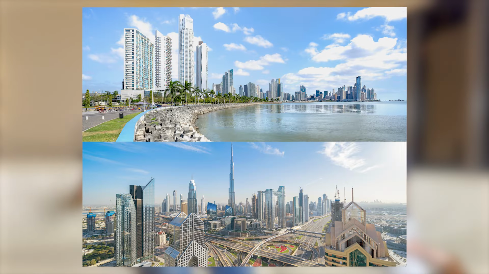
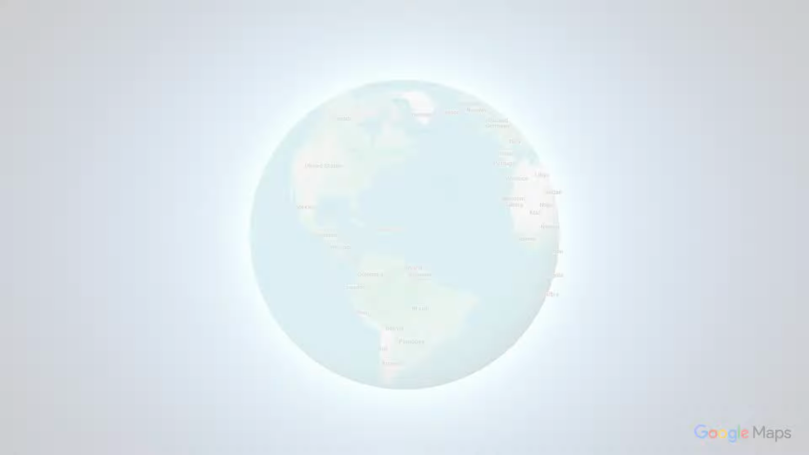
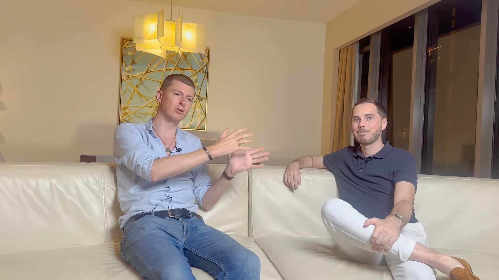
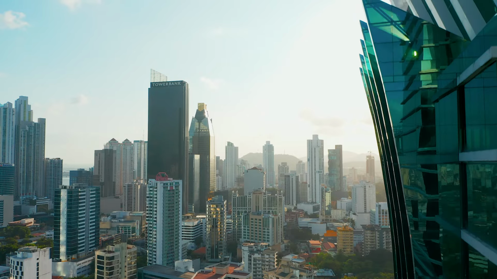
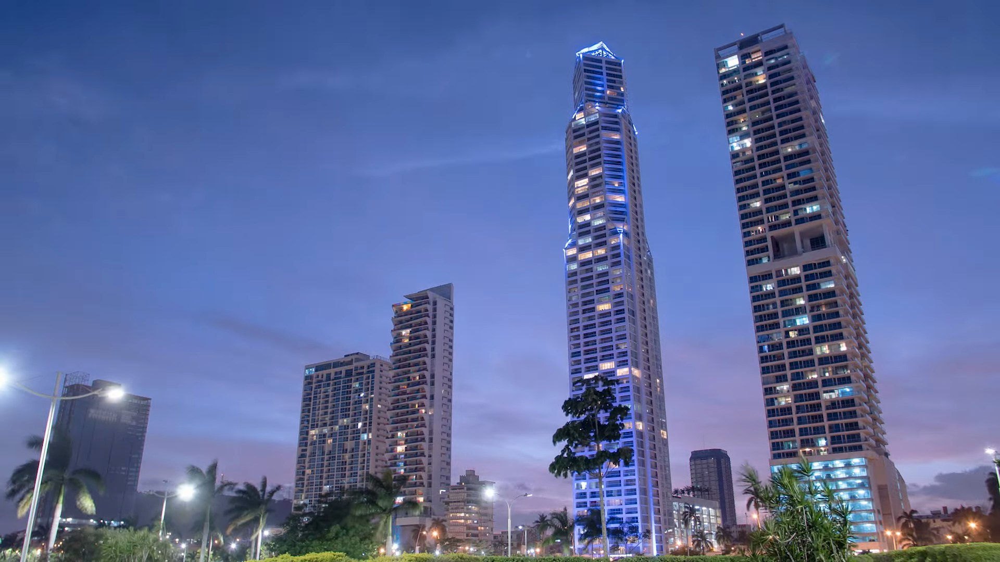
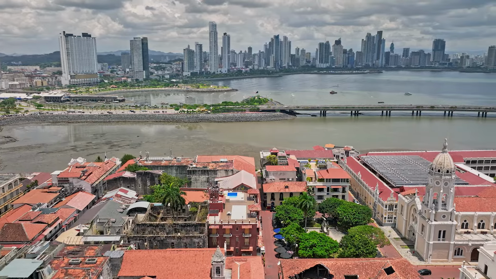
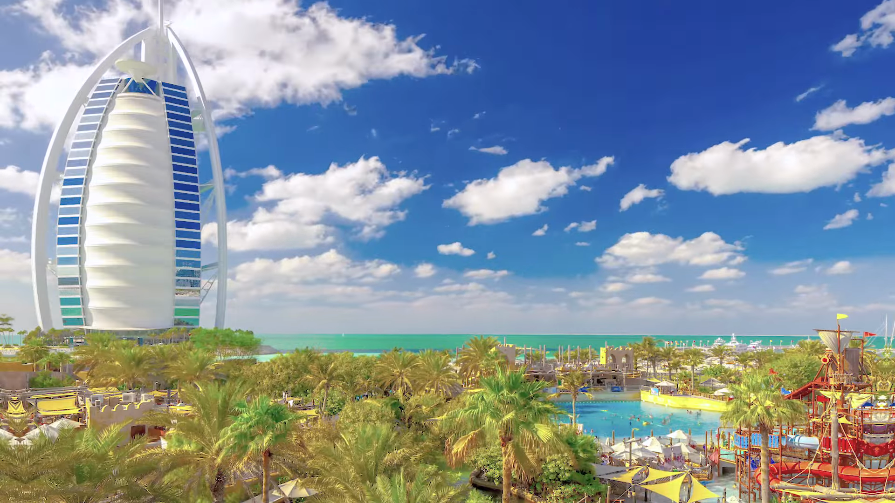
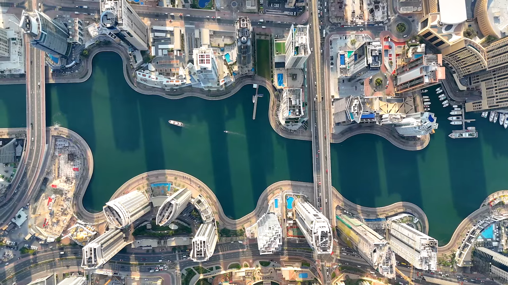
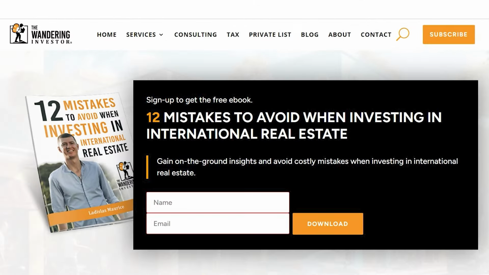

 Hey everyone, so today we're going to have an interesting discussion about Dubai versus Panama.  Because when you go online you have all these people, these influencers, they're either going  Panama, Panama, Panama, others are going Dubai, Dubai, Dubai. Personally, I have residency here

 in Panama. I used to live in Oman for a while, so I used to go to Dubai on a regular basis.  But Julia here, who has a very large French channel on e-commerce and internationalization,

 has been living here in Panama for a few years. He also lived in Dubai and actually went back  and forth between the two. So it was a bit of an emotional roller coaster, right? So you were  initially, I think let's just start this way, you were initially living in Panama,  then you got tired of it. And then you were like, I'm off to Dubai. So why did you leave Panama  and why did you move to Dubai? Well, I think the trigger was the fact that COVID  measure here were really restrictive. So it was a bit of pain at the end. We've been

 locked for one year here. It was bad. We were not able to go out of our apartment during one year.  We were able to go out twice a week, depending on the last number of the ID cards. So it will be  the time slot where you can go out. And women could go out three times a week and men only  twice. And yeah, it was just boring and not the life I was wishing by staying here in Panama.  So it's a little bit of bad luck, let's say, because the previous year were really good.  I mean, when I'm doing this video right now, it's six years or most I'm here. Like I'm in my six

 years. I had some great years before COVID. And then COVID it, they became quite crazy here. Like  they were really afraid of it. Like if you go in an airport, you know where is the flight for Panama,  they're wearing a smatch suit. Like they were really like super afraid of it. So yeah, I just got  tired of it. And my brother was moving to Dubai because he had this company and business and  employees there. So I wanted to stay next to my brother. So okay, it comments me. I was not really  like wanting to go to Dubai, but let's try it. So yeah, I arrived. It was Disneyland. Everything was  open. Everything was close here. So like big difference. So in the first like few weeks, few  months, it was nice. And at some point it evaporates. Like the different. Yeah, I mean, it just  the new gets old. Yeah. Basically, after a few months, I just got back to a normal routine. And  it's the same as a whole you can eat buffet at the beginning of your IP because there is so much to  do blah blah blah. After you get back to your normal life working in your apartment and what  matter is like to have like a nice place, nice nice view, nice nice friends, like a group of friends  and nice restaurants. So yeah, at the end, you feel like the premium you're paying for staying in

 Dubai doesn't worth it compared to staying in Panama. I think for you were sharing a bit earlier,  you were spending I think $8,000 a month here in Panama versus how much in Dubai?  Roughly here my expense for months is between six to eight thousand dollars, more or less every  month. This is why I spend in rents and in eating out and stuff. And to be to I mean, we're here.  We are at we're in a big suite in a five star hotel. He lives full time in a five star hotel.  I rent two. Yeah, he runs two two suites. So for himself and his family. And still he's spending  only six to eight thousand dollars a month. Yeah. So basically yeah, maybe closer to eight  thousands to not to give a wrong expectation. As a single man, yes, five, six, but as a family girl,  yeah. So compare this to Dubai Dubai. It's tough to be under 15k yes. My life thing in Dubai for  the double of the price is 20% lower. Like I don't have the same view. I don't have the same service.  The same quality of service. Yeah, it's just not as good. And so we are comparing the cost of my  life for one month. But in fact, the rent only is like three times more expensive. Yeah, three  friends in Dubai are crazy. Yeah. Yeah. So the first time I've been there is just to give a little bit  of context. The Panama, I did Dubai as a single person. Then I met my wife and then we moved back

 here in Panama. We enjoyed it. We had great time here. And when summer came, as always, we come  back to Istir Rob, Belarisha. And while I was there, I was close to Dubai. So I say, why not  going again there? Give it an as a chance as a family to see if there is a difference between  being single and going there as a family. So Giaz a little bipolar. It hasn't been completely  diagnosed yet. So yeah, I didn't love it first. I mean, it's great option Dubai. I don't want to do  to turn this video in Dubai, because I think it's a fantastic option. And I think it can shoot a lot  of people. I just not for me. That's it. I mean, I can deal with it. I can be there. But I'm just not

 as happy as when I'm here. Like that is the thing. And I'm spending double triple. So at some point,  you just make your calculation. So yeah, I try as a family there. It's great. There is a lot of  a theme park, a cropper. I mean, you name it. They have it all. It's great for family, for fun.  But again, the all you can eat the fat syndrome hits again. And yeah, once you've done all the  same park in the first one two months, okay. Well, what else? Yeah. So yeah, it's coming back to  you have a nice float down your building. You have some nice restaurants, some nice friends. And  does it worth paying like a pollution? Yeah, let's come to something no one ever discusses  about Dubai. It's true. Like lots of entrepreneurs are moving to Dubai. It's so great. It's amazing.  They never talk about pollution. And I mean, I'm making business. I'm making money to live long  and healthy and not to like to die early. So I want to enjoy my life. And I feel staying in Dubai  is going to be a problem for my else and my family else. So that's also one big point making me  going out of Dubai because I mean, I have a little bit of asthma. So I might be more impact  than normal people. But even if you don't have any like respiratory problem, you might still  feel like it's not good air. When you breathe, you don't breathe full. Like you feel like it.  And schools? School, they're pretty expensive. They're good. You have some good international  schools. There is some great option. It's a bigger cities than here. So obviously, they have more  options. The price is about like more than the bulk than here. For the same standard, I  mean, American school. In Panama, we have American school in Dubai. We had American school,  Canadian school, I mean, English speaking school. And basically, you're paying in Dubai maybe  1,200 for half day. Here you pay 580 for full day. Okay, 580 per month for...  And I prefer the accent here. So basically, they're not fluent. They don't have an accent

 like you. A real American, I would say, or English, like fluent speaker. But it's a little  bit better. Obviously, in Dubai, you have Indian, Pakistan, he's a style of al-PERS. And they  have this accent. You don't want... You don't want your child to speak with an Indian accent?  No, not really. I mean, it's not the one that... I mean, it's not my favorite. I don't say my accent  is great, but by any means, it's not that good. I need to practice more. Yeah, I prefer the accent  here. I mean, it's American accent with a little bit of... You can hear a little bit of Spanish  in the background, but it's great accents. I prefer it. Yeah. What about banking? Banking, I think both  are a really interesting option. I will say for the strength of the bank, Dubai, my win,  because it's backed by the government. So, yeah, I think the bank are pretty solid in Dubai.  In Panama, they are quite well-managed. Since the decade, it's a financial hub. So, no problem here,  like all the big Ed in the world, they have money here. So, if they were not trusting the jurisdiction,  they wouldn't put any pens here. But basically, the service in the bank is not as good in Dubai  than it is here. I will say the whole experience in Dubai, you are here as a... I mean, as a...  guest in the country, the visa system, you have to renew every two years, you start all the process,  blah, blah, blah. I mean, you update, it's not as a pain, as when you first come, but still,  every two years, paper again, paper. And here, once you become resident, I mean, you're  resident for life, you become permanent resident, you have to keep your statues to come like once,  every 24 months. But basically, here, you can feel home, and you feel home for banking too.  I will explain myself. So, when my first Emirate ID, almost at the expiration date,  I will say the kindly emailed from my bank in Dubai saying, well, you have one month's to update your  your new Emirate ID. If not, we will lock you right now. Yeah, it's... I had exactly the same thing  in Oman. So, yeah, I don't like this feeling of always being just a guest. I want...  not that I want to mix with the population, I just want to feel home, to feel confidence with  the future that I can still long-term. And that's not something you can feel in Dubai, unfortunately.  For now, I know they are working a lot on it. They were even speaking of giving citizenship,  but wait for it. It's not tomorrow. But they're aware of the problem. If they want to have like  a population that stays, they need to make people feel home. So, I think that at some point,  going to work on it, same for air pollution, we were talking about it. They're doing things to  improve it over the last four years, something like this. They reduced it from few percent already.  It's going to take decades before it become like here, because it's in comparison. Panama, Dubai,  I think here it's six or eight times less pollute. Yeah, big difference, yeah. Yeah, yeah. It's pretty,  like if you go on the website, I don't remember, F quality Swiss, something like this. You will see  the like Panama is most of the time green, which is exceptional for quite a big city. At the  end of the day, it's a one million people living here, and it's pretty good hair quality. And  yeah, it's great. Dubai is really like at the level, I think it's just behind some Indian or Chinese.  I think it's even worse than some Chinese cities, which are famous for being like extremely pollute.  So yeah, that's one point. And maybe we can touch a little bit on regulation, the fact that  the bureaucracy, we can say bureaucracy also. Yeah, yeah. I feel it's becoming like heavier,  any year in Dubai. And if you never came here in Panama, you don't really know what's freedom.  I would say like, I mean, maybe there is some other country that was not just  feeling. Yeah, except except of course. But if you're someone who always have been living in  in the West, I would say you need to come once in a country like this one, and you will understand  like this feeling, this vibe of freedom that you cannot like express through a camera,  through an interview, but like no one really cares. The word is your left alone. No one cares.  No one cares. That's the thing. In Dubai, as I say, you always have to renew your idea,  your stuff. You're always in touch a little bit with you always ask some papers, some stuff.  I will give some random things so you understand. Once I sold the office chair because I was moving,  and I just go down with the office chair in the elevator and the security guard arrived.  So you need a moving permit for this. You could get a fine, but it's okay for this time.  I'm paying $8,000 rent without electricity and internet and everything. So I'm like,  cost me a home in the leg and I'm treat like really bad. I didn't like this feeling at all.  Same like I never used my card to the access card building. I don't like to have  things in my pocket. So basically, I mean, there is concierge. I think we pay service charge for  that, for someone to activate the door to unlock the door. And like once in every month or so,  the guy decided, and my browser is living in these buildings in three years. They sold me like,  I mean, every day. And once every month, months and hours, they decided they don't recognize me.  Are you living here? You contract? Like what's the name on the contract? They do like a full  full check on you ID, everything. Once it was so bad, I had my wife coming down to open the door for me.  $8,000 rent. That's top class tellers. So yeah, it's some details, but it just to illustrate  how terrible can be your life in small things like this. And the issue.  And Dubai, you're always a second to your citizen. Not a citizen. You're just a second to your  guest. Yes. Yes. Second to your guest. That's over right way of putting it. And the thing is,  like all the people in the management team in the building, in like in restaurant and stuff like this,  there are Indians in Pakistanis. And I don't want to do any racist with what I'm going to say right now,  but it just, we don't think the same way. We're not like, we're not wired the same way. And the fact  they are the one who are the one we need to make you comply with regulation and stuff and they get  fired super easily. So they are under pressure. So they make sure everything is like to the tea,  which you don't have here. Like here, it's more like a more flexible. You can talk your way.  Yeah. You can talk your way out of situations. If they make your life impossible here, they ask you

 like a bunch of paper for no matter what. Like I don't know, you want to open a contract or something.  Okay, you say that's what you have on your paper. What's the second way?  And it opens doors all the time. Like there is always a way. And in Dubai, it's missing a bit.  This there is always a way. There is no way because there is rules. It's strict.  But it's why it's working well as well. Like it's clean. It's neat. It's, I mean, it's pristine. Like I was  living in Marina. I mean, you can eat on the floor. It's great. You can leave your iPhone. You're my  book. This you already already know. Here you can occasionally fall into the gutters.  Yeah. Yeah. Yeah. The side, the sidewalk are a bit. But the story you heard on YouTube saying like,  oh, I left my iPhone. I left my wallet in restaurants or something. It's totally true. Like the  girlfriend of my brother, she left on the sidewalk or MacBook Air because she was smoking a cigarette.  She wanted to light and she started to speak about something else. She forget the MacBook Air  for 24 hours. Wow. Yeah. She came back. The MacBook was here. In some of this for school,  the thing is there is so much camera. You you stole it. I mean, you take it even to even if you  don't want to steal it. People won't try because they will think the camera will think they're  going to steal it and they might get some trouble. So people just don't touch. Yeah. That's crazy.  So that's that the safety is like to the roof. I wouldn't say the safety is bad here. Not at all.  It's pretty good if you stay like in the in the center in the city center. Of course,  if you go out, if you go in the suburb in the poor district where you will never go as an expat. But  if you go there, yeah, there is some drags, there is some gangs and stuff like this. But it's not  as bad as I would say. Maybe Colombia or Mexico. I think it's getting better. But I think it's  safer here. It's safer. It's safer here. Yeah. It's not Dubai safe, but it's for Latin America. It's  very safe. It's very safe. I feel I feel extremely safe. I mean, coming from Europe where violence  is everywhere now. Like you walk in Paris. You go like two weeks on holidays in Paris. You will see  someone getting stole. You will see this someone yelling or insulting you in the street. You will  see something like you will you will be in contact with violence within one to weeks. Yeah. In more  than five years here, I've never seen any seen of violence here. Anything. Not a single one. Yeah.  No, it's pretty good. Look at the end of the day. Both destinations are very viable destinations.  Extra again. I'll just add that from a nature point of view, though Dubai has all the deserts and  the oasis and you know, there's all the Oman that's pretty close by it. Here, there's more for  hiking, swimming, surfing, you know, you're an hour or flight away from Costa Rica, from Colombia,  all that. So there's like a lot. I'd say there's probably a bit more to do here than in Dubai.  It depends what you want. Depend what you want. Let's say if you want him parked and stuff like this.  Yeah. Dubai is the place. If you want nature, I mean, it has a lot to offer here. Yeah. Yeah.  But Dubai also. Yeah. You are in Oman and stuff like this. You have some great, great place to.  Yeah. It's both extremely good option. I think it's in the top 10 of the list of like the best  destination to relocate yourself and reduce your tax at the same time. So yeah, I feel confident  both destinations are extremely good. It just depends on you what you're willing to pay. How much  you need to be in Dubai because there is some people they would prefer being in Dubai because it's  closer to Europe. Yeah. For Americans this year makes more sense. Yeah. Canadians. Yeah.  So it really depends like where you need to be. Dubai is a better hub if you want to travel the  world because you go easily in Asia, you go easily in Europe, it's Europe. I mean, it's well-deserved.  Yeah. Panama is greatly deserved as well and they build the second airport. I don't know if you  saw. Now there is terminal two. So they're ready to get some more tourists and more like connecting  flight. It's like the main destination for connecting flight and the company, the local company,  by the way, is the one the most on time in all Latin America, Copa Online. Yeah. So yeah, it's  still okay to move around but you maybe have more option in Dubai. Yeah. Cool. I think this gives  this is an interesting discussion. Yeah. So if you're interested in moving to Panama, there's a  link below with more information on how to move to Panama. There's also an email below. You can  contact the gentleman there. If you want to move to Dubai, he'll give you a quote if you want to  create a company, etc. To be able to move to Dubai. Generally speaking, it's easier and more  affordable to move to Panama. Getting the residency permit is 30% cheaper and then you get the  permanent residency that you don't need to renew after. Yeah. It's over. After you finish the process,  Dubai you will have always to do it again. So it's like a... Panama is a better plan B.  Plan A up to you. Plan B, Panama is always better, essentially. I would say so.  Cool. Thank you very much. Well, thank you. Bye.  Make sure to download my free ebook, 12 Mistakes to Avoid When Investing in International Real Estate,  which you can find on my website, link below and feel free to follow me on Instagram at the  Wondering Investor. I look forward to hearing from you.